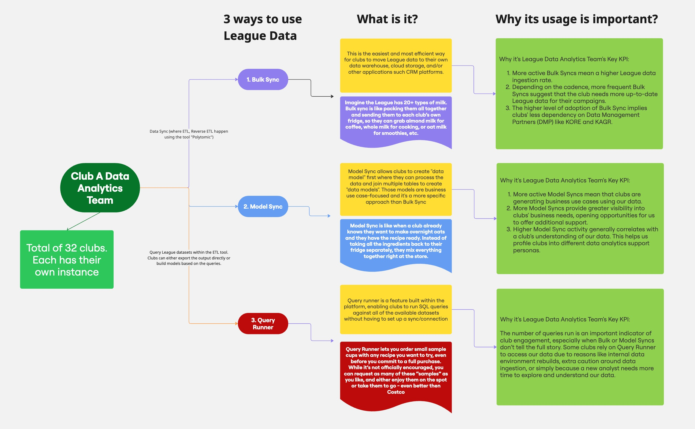

# club-sql-engagement-analysis

## Context

Here at the League, 32 clubs use our fan engagement datasets daily for internal operations, marketing, and ticket sales. Part of my job is to understand:
1. What data is being used and how, so I can relay insights to data engineers to help improve the tables.
2. Who is using our data, in what way, and for what kinds of analytical projects, so we can better understand their goals and be prepared to consult them with relevant datasets, use cases, and best practices.
3. The overall usage of our data, which is one of the most important KPIs for our department. My stakeholders use insights from the usage report to promote and update the Fan 1:1 program in League steer-co meetings with the 32 club owners.

In short, understanding club data usage is critical. Both externally, to ensure we continue delivering the best data in the industry, and internally, to drive adoption of the Fan 1:1 program among ownership (especially thanks to the revenue share structure between the League and 32 clubs).

For more context and detail on the Clubs **League Product Usage Analysis** workstream, please see this chart:

## More about this project

### Challenge
SQL queries usually give significant clues about what the user intends to do with our datasets, thus it's helpful for us to gauge their engagement and maturity with our data. The challenge is quite similar to qualitative analysis where we analyze survey results. Each SQL query is like a sentence saying "I want to see the top 10% of ticket buyers who also have $100K+ income, in the year of 2024, oh and I don't like brokers so let's cap the ticket purchases at $10K revenue.

### Solution
Considering the overall goal of this usage report, in order to gauge users' behavior, I looked into users' queries from a few metrics:
  1. Complexity of the query (scoring)
  2. Unqiue table used
  3. Completeness

By having those metrics, we can look into each club's engagement with our data and how deep the analysis is that they're trying to achieve.

### Approach

#### 1. Complexity
We score each query following the scoring logic based on each clause the query used: 

Basic Query Features (1-2 points)
+ Specific column selection (+1): Avoids SELECT *, showing intentional data selection
+ LIMIT clause (+1): Demonstrates result set control
+ ORDER BY (+1): Basic result sorting

Filtering and Grouping (2 points each)
+ WHERE clause (+2): Data filtering logic
+ HAVING clause (+2): Post-aggregation filtering
+ GROUP BY (+2): Data aggregation grouping

Advanced Operations (3+ points)
+ JOIN operations (+3 per join): Table relationship complexity
+ Subqueries (+3 each): Nested query logic
+ Set operations (+5): UNION, INTERSECT, EXCEPT operations
+ Common Table Expressions (WITH) (+5): Advanced query structuring

Aggregation Functions (Tiered scoring)

+ First aggregation function (+2): COUNT, SUM, AVG, MAX, MIN
+ Additional aggregations (+1 each): Diminishing returns for multiple aggregations

Expert-Level Features (6 points)

+ Window functions (+6): OVER() clauses for advanced analytics
+ PIVOT/UNPIVOT (+6): Complex data transformation operations

Complexity Categories

#### 2. Unique Table Used
The script processes up to 6 tables per query, extracting and normalizing table names from both data environments:

+ Legacy tables: AwsDataCatalog.schema.tablename_vw → tablename
+ Gridiron tables: schema_ptc.ptc_tablename → tablename

##### Unique Table Metrics
+ Query-level
table_used_num: Count of distinct tables referenced in a single query

+ club-level Aggregation
unique_legacy_tables: Distinct legacy tables used by each club
unique_gridiron_tables: Distinct Gridiron tables used by each club

#### 3. Completness

+ Complete (1): Query contains identifiable table patterns (AwsDataCatalog.* or *_ptc.*)
+ Incomplete (0): No valid tables found, malformed syntax, or parsing errors

### Future Improvements

1. Column-level analysis: Implement tracking of specific columns used to reveal data granularity patterns and identify which teams focus on customer vs. operational metrics, providing deeper insights into analytical intent.
2. Automated versioning and historical tracking: Replace manual execution with scheduled pipeline runs that create timestamp-based output folders. This enables trend analysis of engagement patterns and platform adoption over time.
3. Integrated QA steps: Build automated data validation steps including completeness checks, anomaly detection, and output verification to ensure reliable analytics without manual QA overhead.
4. Enhanced table usage analytics: While current output provides essential data cuts for SQL analysis, future versions could include pre-built visualizations, trend analysis, and automated insights to reduce analyst workload and accelerate decision-making.
5. Real-time monitoring: Implement streaming analysis capabilities to provide immediate feedback on query patterns and user engagement. As of July 27, 2025, I'm working the team to build dashboard using on top of this pipeline.
